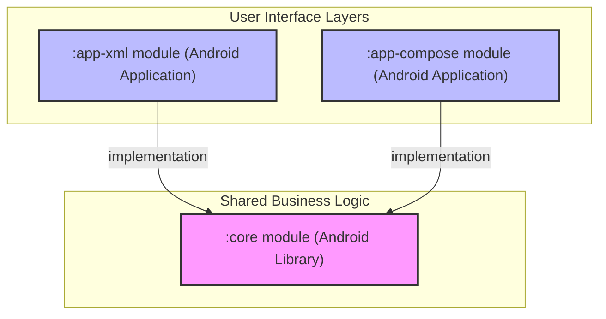

# 12 – Module Dependency Diagram

The following diagram represents the high-level dependency structure of the Dog Image Browser project after the MIP-3 refactoring.

## Dependency Graph

---

## Architecture Summary
- **Unidirectional Flow**: Both application modules point strictly towards the `:core` module.
- **Zero Circular Dependencies**: There is no dependency between `:app-xml` and `:app-compose`.
- **Decoupled Business Logic**: The `:core` module has no awareness of the UI frameworks (XML or Compose) that consume it, ensuring a clean separation of concerns and making the project future-proof for additional UI modules.
